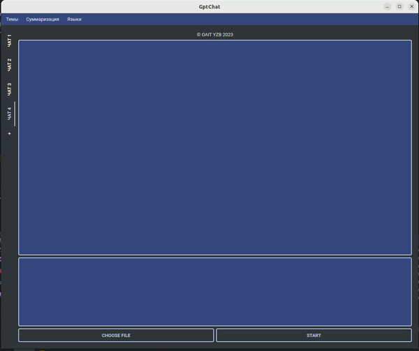

# ChatGPT GUI + Files2TextSummarization

## Navigation:

1. [Problem](#problem)
2. [Libraries](#libraries)
3. [What the Program Does](#what-the-program-does)
4. [Program Overview](#program-overview)

### 1. Problem 
The challenges addressed by this project include:
- Enabling the use of ChatGPT from a local machine without the need for OpenAPI authentication.
- Efficiently extracting and summarizing information from text files without having to open them individually.

### 2. Libraries 
-  - A library for interfacing with ChatGPT.
-  - PyQt5 for building the graphical user interface.
-  - SQLite for managing and storing chat information.

### 3. What the Program Does 
The program is designed to:
- Parse text files in various formats to generate summarized information about their content:

- Allow users to utilize the ChatGPT API for answering questions.
- Store information about chats in a structured manner.
- Provide users with the flexibility to choose the theme or topic of interest.

### 4. Program Overview 

- **Executable:** 
  

